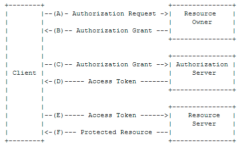

# 1、OAuth2.0简介

​		开放授权（Open Authorization 简称OAuth）是一种资源提供商用于授权第三方应用代表资源所有者获取有限访问权限的授权机制。由于在整个授权过程中，第三方应用都无需触及用户的密码就可以取得部分资源的使用权限，所以OAuth是安全开放的。

​		OAuth第一版本诞生于2007年12月，并与2010年4月正式被IETF作为标准发布（编号RFC5849）。由于OAuth1.0复杂的签名逻辑以及单一的授权流程存在较大缺陷，随后标准工作组又退出了OAuth2.0草案，并在2012年10月正式发布其标准（编号RFC6749）。OAuth2.0放弃了OAuth1.0中让开发者按到痛苦的数字签名和加密方案，使用已经得到验证并广泛使用的HTTPS技术作为安全保障手段。OAuth2.0与OAuth1.0互不兼容，由于OAuth1.0已经基本退出历史舞台，所以目前广泛使用的都是OAuth2.0。

#  2、OAuth2.0使用示例


​		在登录开源中国时，提供多种登录方式。如图所示支持码云、微信、GitHub、QQ、Stackoverflow方式登录，这是一种典型的OAuth2.0的使用场景。

​		假设选中QQ方式登录页面会跳转至QQ授权登录页面（该页面位于腾讯站点，登录成功之后会跳转回开源中国网站，这样就避免了在第三方网站直接提交QQ密码）


​		从QQ授权登录可以看出OAuth2.0认证流程与机制。

# 3、OAuth2.0协议中的角色

OAuth2.0定义了四个角色，结合使用示例来分析四个角色。

- Resource Owner：资源所有者，通常指用户，例如每一个QQ用户
- Resource Server：资源服务器，指存放资源所有者受保护资源的服务器，通常需要访问令牌（Access Token）才能进行访问。例如存储QQ用户基本信息的服务器，从当的就是资源服务器角色
- Client：客户端，指需要获取资源所有者信息的第三方应用，例如开源中国网站
- Autherization Server：授权服务器，用于验证资源所有者，并在验证成功之后向客户端发放相关令牌。例如QQ授权登录界面

# 4、OAuth2.0协议流程



- （A）：客户端向资源所有者请求对其授权

- （B）：`客户端收到资源所有者的授权许可，这个许可是一个能代表资源所有者授权的凭据`

- （C）：客户端携带资源所有者的授权许可，向授权服务器申请资源服务器的访问令牌

- （D）：授权服务器验证客户端及其携带的授权许可，确认有效后发放访问令牌

- （E）：客户端携带访问令牌向资源服务器请求受保护的资源

- （F）：资源服务器校验访问令牌，确认无误后向客户端提供资源

  ​	在上述的OAuth2.0工作机制中**B步骤**最为重要。

# 5、OAuth2.0协议授权类型

​		OAuth2.0规范文件（ [RFC 6749](https://tools.ietf.org/html/rfc6749)）中定义了四种获得令牌的流程，具体使用哪种需要根据业务场景决定。

- 授权码（Authorization Code）
- 隐藏式（Implicit）
- 密码式（Password）
- 客户端凭证（Client Credentials）

> 不论哪一种授权方式，第三方应用申请令牌之前，都必须先到系统备案，说明自己的身份，然后会拿到两个身份识别码：客户端ID（Client ID）和客户端密钥（Client  secret），这是为了防止令牌被滥用，没有备案过的第三方应用，是不会拿到令牌的。

## 5.1、授权码方式

​		授权码方式是功能最完整、流程最严密的授权模式，它将客户端引导到授权服务器进行身份验证，授权服务器将发放的访问令牌传递给客户端。授权码通过前台传送，令牌则是存储在后端。所有与资源服务器的通信都在后端完成。这种方式下避免令牌泄漏。

第一步：oschina.com网站提供一个链接，用户点击链接会跳转至qq.com网站，授权用户数据给oschina.com网站使用。示例链接格式如下：

```
GET http://qq.com/oauth/authorize?client_id={client_id}&response_type={response_type}&scope={scope}&redirect_uri=oschina.com
```

​		链接参数说明：

- client_id：指客户端ID，用于标识客户端是否已知
- response_type：指授权类型，授权码方式固定值为`code`
- scope：指申请的权限范围
- redirect_uri：接受或拒绝请求的地址

第二步：用户跳转至qq.com网站会要求用户进行登录，然后会询问是否同意给予oschina.com网站授权。用户表示同意，这时qq.com网站就会跳回`redirect_uri`参数指定的网址。跳转时会回传一个授权码。

```
http://oschina.com?code=3ueQ0p
```

​		链接参数说明：

- code：指授权码

第三步：oschina.com网站拿到授权码，就可以在后端向qq.com网站请求令牌

```
https://b.com/oauth/token?client_id=CLIENT_ID&client_secret=CLIENT_SECRET
&grant_type=authorization_code&code=AUTHORIZATION_CODE&redirect_uri=CALLBACK_URL
```

​		需要使用`POST`请求方式发送，需要携带如下参数及注意项

- grant_type：授权类型，授权码模式填写authorization_code
- code:：授权码，授权码使用一次就失效了，需要重新申请
- redirect_uri： 申请授权码时填写的地址
- client_id：
- client_secret：

